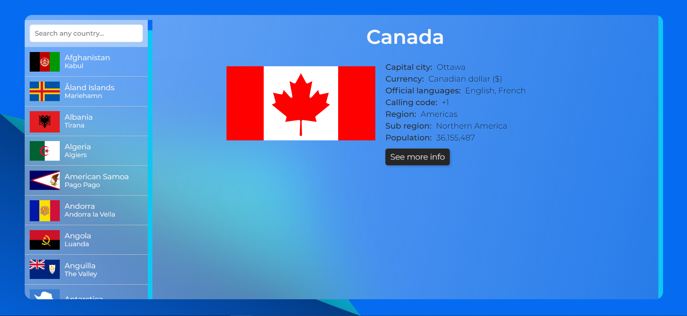

# Countries info

A simple glass morphic design site showing details about different countries.

**To clone the site to your local machine follow**

`git clone https://github.com/Basharath/countries`

`cd countries`

`npm install`

> You can see the live demo at: https://countries-details.netlify.app/
